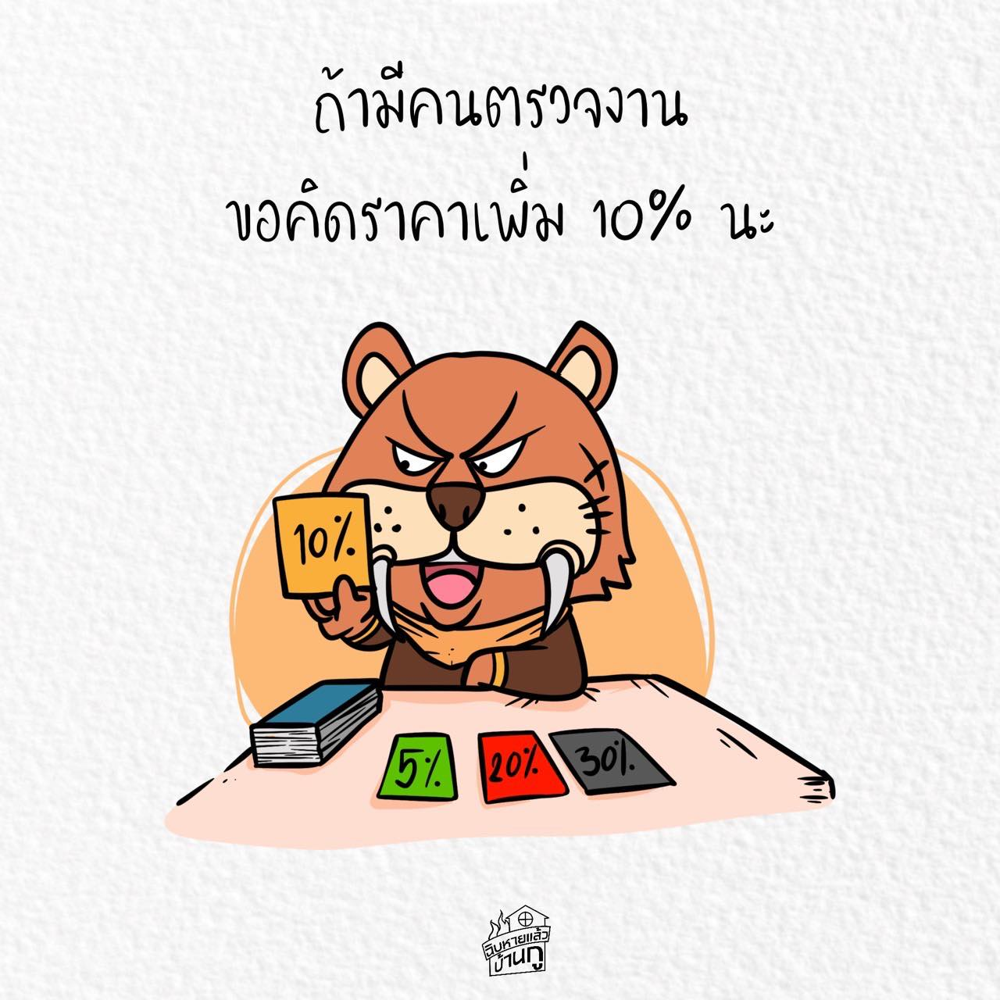

การก่อสร้าง มีมาตรฐานการก่อสร้าง เป็นบรรทัดฐาน

มีแบบ ให้ดูเพื่อทำตาม

มี BOQ เพื่อสรุปร่วมกันถึง ปริมาณ วัสดุ ราคาของ และ ค่าแรง

ดังนั้น เมื่อสร้างบ้าน แม้จะมีหรือไม่มีคุนคุมงาน
สิ่งที่เฮียเหมา กับ ลุงเข้ต้องทำ คือ
ก่อสร้าง ตามแบบ
ใช้วัสดุ และปริมาณราคา ตาม BOQ
และ ทำงาน ตามมาตรฐานการก่อสร้าง

-

ไม่ใช่พอเจ้าบ้านจะมีคนตรวจงาน ก็ต้องมาขอคิดเงินเพิ่มเติม เท่านั้น เท่านี้ โดยอ้างว่า มีคอนเซาท์ มีคนตรวจงานแล้ววุ่นวาย ทำงานยาก

เพราะจะมี หรือ ไม่มี มันก็ไม่ได้จะทำงานต่างกันตรงไหน ที่แตกต่างมีเพียงอย่างเดียว คือ
พิกกีตรวจเอง น่ะ ดูไม่ออก ทำงานยังไง มั่วแค่ไหน ยัดไส้ ลักไก่ ใช้ของผิดสเปค ก็ผ่าน

แต่ถ้ามีคนตรวจ มันหมกไม่ได้ ลักไก่ก็ไม่รอด

นี่ไงละที่ทำให้ราคาต้องเพิ่มเติมขึ้น

-

ลุงเข้ เฮียเหมาไหน ที่บอกเจ้าบ้านว่า
ถ้าจะมีคนตรวจ ต้องเพิ่มราคา

ให้พิกกี้รู้ไว้เลย คำนี้แปลตรงตัวง่ายๆว่า
กูตั้งใจจะลักไก่มึง

ดังนั้น พิกกี้ก็จะหลีกเลี่ยง เฮียและลุงสันดานนี้
ไปหาจ้างคนอื่นที่ไม่คิดทำงานสองมาตรฐาน
จะ ดี กว่า นะ