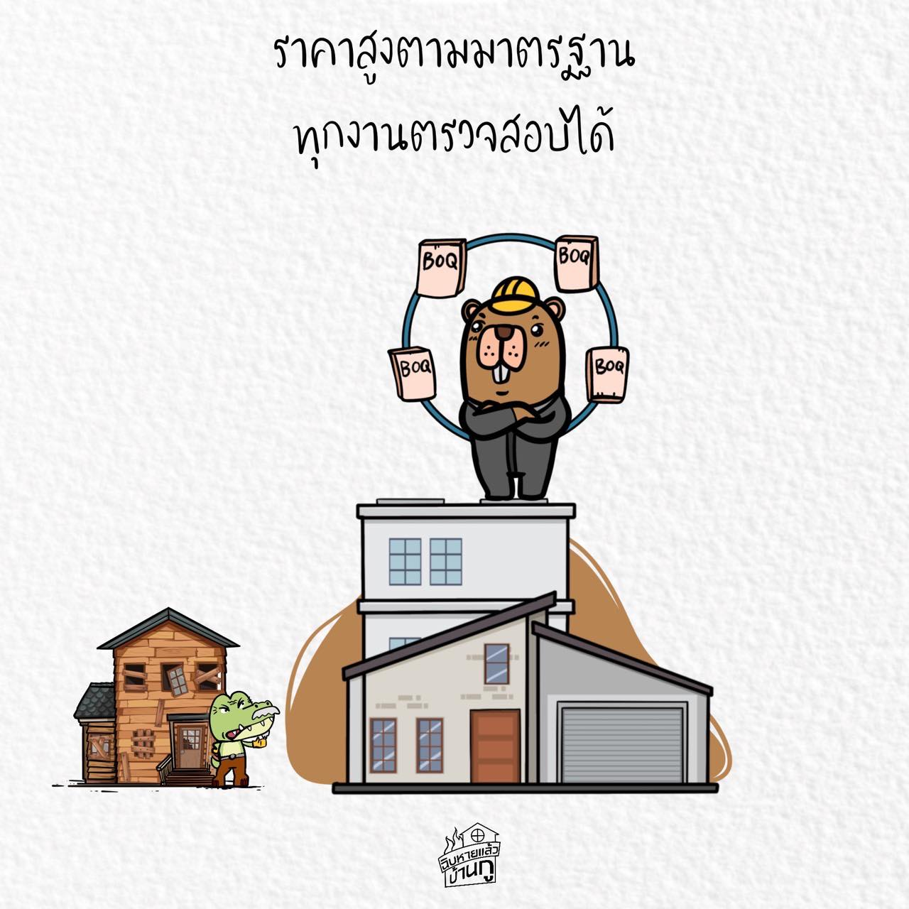

## ราคาแพง หรือ ราคาถูก
การเปรียบเทียบ ต้องทำโดยเชคจาก แบบ และ BOQ ที่ชัดเจน

เมื่อต้องการเทียบราคาของงานก่อสร้างใดๆ
ไม่ว่าจะสร้างอาคารใหม่ รีโนเวท หรือตกแต่งภายใน

ต้องสร้างรายการงานที่ต้องทำ
และจำนวนงานนั้นๆ ที่ถูกต้องชัดเจนขึ้นมาก่อน
โดยการออกแบบ เขียนแบบ และ แกะ BOQ

จากนั้น ส่งแบบ และ BOQ ให้คนที่สนใจอยากทำงานของเรา แล้วให้แต่ละคน กรอกราคา ค่าวัสดุ และ ค่าแรง ตามแต่ละข้อใน BOQ มา

-

เมื่อทำแบบนี้ แปลว่าทุกเจ้าจะต้องทำงานด้วย วัสดุและวิธีการแบบเดียวกัน ตามแบบเดียวกัน และ มีจำนวนงานต่างๆ เท่ากัน

และนี่แหละ ถึงจะทำการ เทียบราคา ได้
ว่าเจ้าไหนที่ราคาถูก เจ้าไหนราคาเทียม

-

การที่เจ้าบ้าน มีแบบที่ไม่ละเอียด
และไม่มีการถอด BOQ ออกมาแบบถูกต้องจริงจัง

แล้วส่งแบบนั้น ไปยัง ผรม เจ้าต่างๆ
แต่ละเจ้า ก็จะตีราคาเอามั่วๆ ตามใจตัว

เช่น เจ้าที่เคยแต่ทำงานมาตรฐานมา
ก็จะตีด้วยวัสดุเกรดสูงในแต่ละงาน

อิฐมวลเบา ใช้ Qcon
สายไฟ ใช้ เฟลดอจด์ ( เออเขียนผิดนี่แหละ )
คอนกรีต ใช้ ซีแพค
ท่อประปา ใช้ ท่อน้ำไทย

แต่อีกเจ้า เคยแต่ทำงานถูกๆมา
ก็ตีราคาด้วยของที่คุ้นเคย

อิฐมวลเบา ใช้ บีโบ้
สายไฟ ใช้ ตรานกกระปูด
คอนกรีต ใช้ แพลนโนเนม
ท่อประปา ใช้ ตราลิงถือบักเขียบ

แบบนี้ถึงปริมาณจะใกล้เคียง แต่ ราคาก็ยังต้องออกมาห่างกัน เพราะราคาวัสดุที่แตกต่างกันอย่างมาก

-

แถม ถ้าเจ้าที่ละเอียด เค้าเห็นว่ามีงานตกหล่น จึงเติมสิ่งที่ขาดเข้ามาให้ครบ เพื่อให้เจ้าบ้าน ได้เห็นราคาแท้จริง

แต่อีกเจ้า ไม่ได้ตรวจ หรือ แกล้งทำไม่ใส่ เพื่อจะให้งานตกหล่นแล้วไปขอเพิ่มเติมเอาภายหลัง จะได้เพิ่มเงินได้แพงๆ ในงานดังกล่าว

-

เห็นยังว่า ถ้าไม่ทำกระบวนการก่อนส่งเทียบราคาให้ถูกต้อง พิกกี้ไม่มีทางรู้หรอกว่า เจ้าไหน ที่คุ้มค่า คุ้มราคาจริงๆกันแน่

เอาละ เราเข้าใจว่า พิกกี้คงทำไม่เป็น
อันนี้ก็ต้องแนะนำ ให้ไปจ้างคนที่เค้าทำเป็นมาช่วย

อาจจะต้องจ่ายค่าจัดประมูล จ่ายค่าที่ปรึกษา
แต่เชื่อเหอะ ทำแล้ว คุ้มค่า ดีกว่าต้องมาจ่ายเงินไป แล้วได้ของห่วย ได้งานไม่ครบ บานปลายภายหลัง

แล้วจะบอกว่า รู้งี้ ก็ไม่ทันแล้วนะ พิกกี้