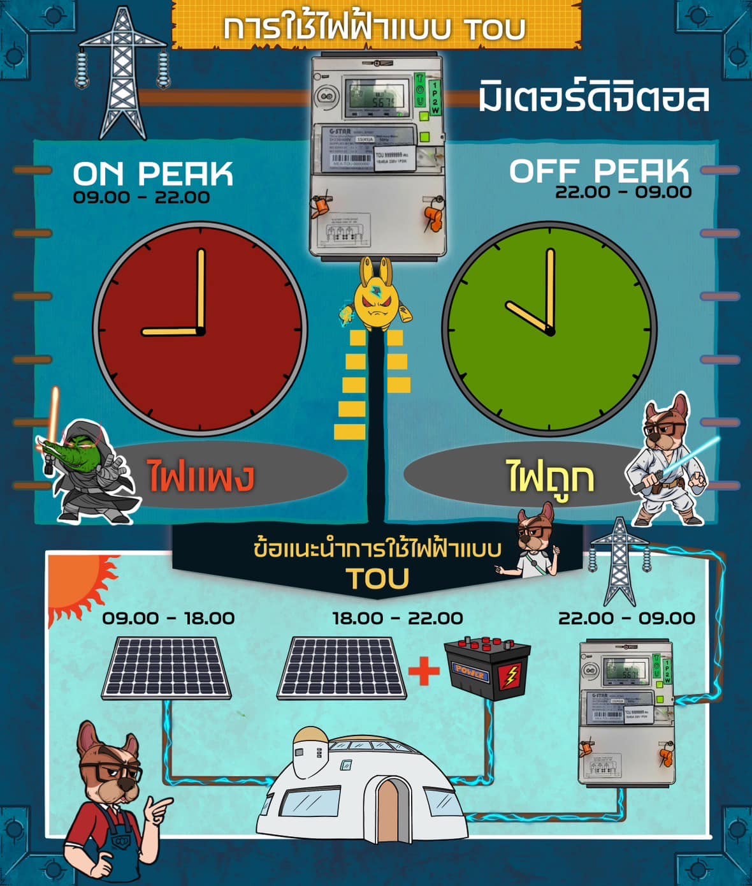

การใช้ไฟฟ้าแบบ TOU

เพื่อให้บริการไฟฟ้ากับประชาชนอย่างพอเพียง ทางการไฟฟ้าต้องทำการเตรียมกระแสไฟฟ้าไว้เพื่อขายให้เราตลอด 24 ชั่วโมง

โดยการเตรียมนั้น ส่วนหนึ่งคือการจัดหาระบบผลิตไฟฟ้าและการซื้อไฟฟ้าเข้ามาเพื่อเตรียมจ่ายไปสู่ระบบ และปัญหาคือ ไฟฟ้านี้มันเก็บได้ยาก
และกลางคืน ปริมาณการใช้ไฟฟ้าก็จะลดลงอย่างมาก ทำให้ไอ้ที่เตรียมไว้มันจะต้องเสียทิ้งไป

จริงๆ จะบอกว่า กลางวันกับกลางคืน ก็ยังไม่ถูกนักหรอก ต้องบอกว่าเวลาที่คนใช้ไฟมาก ( peak time ) กับเวลาที่คนใช้ไฟน้อย ( off peak )

เวลาที่คนใช้ไฟมาก ส่วนใหญ่ก็จะเป็นเวลาตั้งแต่ 9.00 - 22.00 เพราะเป็นช่วงที่ โรงงาน ห้าง ร้าน เปิดทำการนั่นแหละ

ส่วนเวลาที่คนใช้ไฟน้อยลง ก็จะเป็นช่วงตั้งแต่ 22.00-09.00 และ ช่วงวันหยุด เสาร์ อาทิตย์ นขัตฤกษ์ต่าง ๆ ซึ่งเป็นช่วงที่โรงงาน ห้าง ร้าน ปิดทำการ

ตรงนี้เอง จึงเกิดการจูงใจให้คนมาใช้ไฟฟ้าช่วงที่ใช้น้อยกันให้มากขึ้น ด้วยการลดราคาไฟฟ้าในเวลานี้ให้ถูกลง โดยให้เปลี่ยนไปใช้มิเตอร์ไฟฟ้าชนิด TOU ซึ่งย่อมาจาก TIME OF USE

-

ถ้าเราเป็นโรงงาน หรือ เป็นอุตสาหกรรมอะไรก็ตาม ที่สามารถจะทำงานในช่วงเวลาที่ไฟฟ้าถูกลงได้ ( ส่วนใหญ่ก็หลัง 4 ทุ่ม ) ก็จะทำให้ประหยัดต้นทุนได้ ดังนั้น ในโรงงานที่ใช้ไฟกันเยอะๆ ก็จะใช้วิธี

1. ในตอนกลางวัน ไปใช้พลังงานทางเลือกอื่นๆ เช่น พลังงานแสงอาทิตย์ สลับกับยอมจ่ายค่าไฟตามเรตปกติ หากพลังงานทางเลือกไม่เพียงพอ

ส่วนกลางคืน ที่ไม่สามารถผลิตไฟด้วยแสงอาทิตย์ได้ ก็มาใช้ไฟที่ราคาต่ำลงจากระบบ TOU

วิธีแบบนี้ อาจจะไม่สมูทนัก มีช่วงเวลาที่อาจจะต้องจ่ายค่าไฟแพงบาง เช่นช่วงเวลาตั้งแต่ 18.00-22.00 ซึ่งผลิตไฟด้วยแสงไม่ได้ ค่าไฟก็ยังไม่ถูก

แต่ข้อดีคือ มันก็จะไม่ต้องลงทุนสูงนัก เพราะไม่ต้องลงทุนระบบอะไรมากมาย

-

2. ใช้ระบบผลิตไฟฟ้าแสงอาทิตย์ในช่วงที่ใช้ได้ และ ลงทุนสร้างที่เก็บไฟฟ้ามาเก็บพลังงานที่ผลิตได้บางส่วน และ เก็บพลังงาน ในช่วงค่าไฟถูกลง เพื่อเอาไฟที่เก็บไว้มาใช้ในเวลาที่ไฟฟ้าแพง

วิธีแบบนี้ จะทำให้สามารถบริหาร และใช้ไฟราคาถูกได้แทบจะตลอดเวลา เพราะมีการเก็บสำรองไว้ได้

แต่นั่นแหละ วิธีนี้ก็จะมีค่าใช้จ่ายในการสร้างระบบเก็บไฟ สูงขึ้นด้วย

-

ทีนี้ ถ้าเราสามารถเก็บเอาไฟฟ้าที่มีราคาถูกไว้ แล้วเอามันมาใช้ในเวลาที่เราต้องการ ก็จะทำให้เราประหยัดเงินได้

ไฟฟ้ามันก็คล้ายๆน้ำ เพียงแต่ที่เก็บมันแตกต่างกัน
น้ำประปา มีถัง มี โอ่ง ก็เปิดน้ำใส่เก็บไว้ อยากให้ก็ไปตักมา
แต่ไฟฟ้า ถ้าจะเก็บ จะต้องมีระบบแบตเตอรี่เอาไว้เก็บไฟ

ดังนั้น ระบบในการเก็บไฟตรงนี้แหละที่จะทำให้เกิดความแตกต่าง ในด้านความคุ้มค่า ที่ต่างกัน

คนออกแบบระบบดีๆ อาจจะสามารถทำที่เก็บไฟจำนวนมาก ในราคาที่ต่ำ
ส่วนที่ออกแบบไม่ดี ก็อาจจะต้องจ่ายแพงๆ แต่เก็บไฟได้น้อยกว่า

-

พอรู้จักระบบนี้แล้ว ทีนี้ก็ต้องมาคิดเองแล้วว่า
เราจะลงทุนระบบแบบไหน สำหรับอาคารของเราดี

จะทำแค่ใช้มิเตอร์ TOU เพื่อให้ไฟในตอนกลางคืนถูกลง
เพื่อจะได้เปิดแอร์ให้เต็มที่ทุกห้องนอน

หรือจะทำระบบเก็บไฟไว้ด้วย
เพื่อเอาไฟราคาถูกนี้ ไปใช้ตอนช่วงไฟแพง
เพราะบ้านเราอาจจะมีการใช้ไฟช่วงกลางวันมากด้วย
แต่ละบ้านก็แต่ละเคส พิจารณากันตามความเหมาะสมของตัวเองเอานะ

