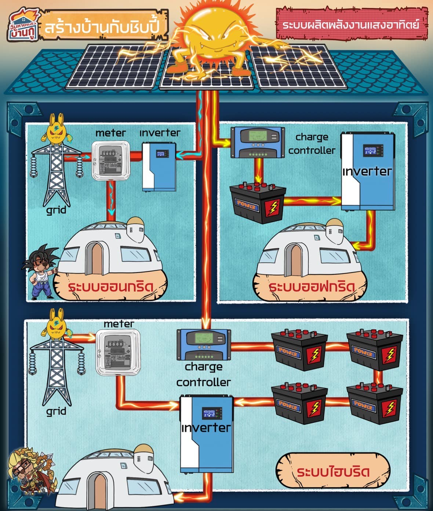

ระบบผลิตพลังงานแสงอาทิตย์

เมื่อค่าไฟแพง และ โลกตื่นตัวกับพลังงานสะอาดกันมากขึ้น พลังงานทางเลือกสำหรับบ้าน อย่างการติดตั้งแผงผลิตวงจรไฟฟ้าจากพลังงานแสงอาทิตย์ จึงได้รับความสนใจเพิ่มมากขึ้น

ติดแล้วคุ้มหรือไม่ ควรติดหรือเปล่า
อันนี้ขอไม่พูดถึงแล้วกัน เพราะมันแล้วแต่มุมมอง ความชอบ และ ปริมาณการใช้ไฟ

แอดขอเล่าในเรื่องอื่นๆที่ต้องทราบ
เมื่อจะทำการติดตั้ง ใช้งานระบบโซลาเซลล์ ให้ฟังแทน เพื่อให้เห็นแนวทางที่เป็นไปได้แทนแล้วกัน

-

ระบบโซลารูฟ เรียกแบบนี้เพราะมักติดกันบนหลังคา จริงๆ ถ้ามีที่เยอะๆ จะวางไว้บนพื้น หรือเอาไปลอยน้ำที่บ่อน้ำ ก็มีคนทำนะ

ระบบมันมี 3 แบบใหญ่ๆ คือ
1. ออนกริด
1. ออฟกริด
1. ไฮบริดจ์

-

## 1. ระบบ ออนกริด 
ก็คือระบบที่ยังมีการต่อเชื่อมกับระบบจ่ายไฟฟ้าของการไฟฟ้า

ระบบนี้จะผลิตไฟจากแสงอาทิตย์มาเข้าที่มิเตอร์การไฟฟ้า แล้วใช่งานตรงๆไปเลย ผลิตแล้วใช้ทันที ไม่มีการเก็บ

ถ้าผลิตได้มาก อาจจะทำสัญญาขายไฟฟ้าให้การไฟฟ้าได้ แต่ต้องทำสัญญากับการไฟฟ้าก่อนนะ

ข้อดีของระบบนี้คือ มันทำง่าย ราคาไม่แพง อุปกรณ์น้อย
แถมยังไม่ค้องห่วงเรื่องเวลาฝนตก ฟ้ามืด ผลิตไฟไม่ได้ ก็ยังมีไฟจากการไฟฟ้าจ่ายมาให้ใช้แทนแบบไร้รอยต่อ

ส่วนข้อเสียคือ ถ้าไฟจากการไฟฟ้าดับ ระบบของเราจะดับไปด้วยนะจ๊ะ

-

## 2. ระบบ ออฟกริด 
อันนี้ก็คือระบบที่ผลิตแล้วเก็บไฟไว้ใช้เอง โดยไม่ต่อผ่านระบบไฟฟ้าของการไฟฟ้า

บ้านไหนใช้ไฟม่ก ก็ติดแผงเยอะๆ ใส่แบตเตอรี่ หรือ ที่เก็บไฟไว้มากๆ

ข้อดีคือ ถ้าลงทุนติดตั้งให้เพียงพอต่อการใช้งานแล้ว ก็ไม่ต้องจ่ายค่าไฟอีกเลย ( แต่จะคุ้มมั้ยไปคิดเอง )

ข้อดีอีกอย่างคือ ไฟฟ้าในบ้านจะเสถียรมาก ยิ่งวางระบบไว้ดี ยิ่งเสถียร ไม่ค่อยมีปัญหาไฟตก ไฟเกิน

ข้อเสียคือ แพงฮะ แพงตรงค่าแบต ค่าอุปกรณ์ และค่าบำรุงรักษานี่แหละ ยิ่งอยากใช้ไฟมาก ก็ยิ่งต้องเสียเงินมากตามไป
แถม ในช่วงหน้าฝน ซึ่งแดดอาจจะหายหน้าไป ช่วงนี้อาจจะทำให้พลังงานไฟฟ้าที่สำรองไว้หมด แล้วเกิดปัญหาไม่มีไฟใช้ได้

-

## 3. ระบบไฮบริดจ์

อันนี้ก็เป็นระบบครึ่งบกครึ่งน้ำ คือเป็นระบบที่เอาข้อดีของทั้งสองนะบบมารวมกัน กูผลิตเอง เก็บเอง ใช้เองด้วย
แต่เมื่อไหร่ที่ต้องการ กูก็ดึงไฟจากระบบการไฟฟ้ามาใช้ได้ด้วย

เรียกว่ามีไฟให้เลือกใช้ 3 แหล่งเลยคือ
ใช้ตรงจากการผลิตของแผ่นโซล่า ณ ตอนนั้น
หรือ ใช้จากที่โซลา ผลิตไปเก็บไว้ในแบต
หรือ ใช้ไฟตรงจากระบบการไฟฟ้า

ซึ่งไอ้ระบบนี้ ทำให้สามารถวางแผนเล่นกับค่าไฟได้หลากหลาย ช่วงเช้าผลิตไฟได้เยอะ ใช้งานไฟได้มาก เลือกเป็นระบบใช้ไฟตรง แล้วแบ่งบางส่วนไปเก็บในแบตเตอรี่ เพื่อใช้ในช่วงหัวค่ำ ซึ่งไฟแพง จากนั้นช่วงดึก ทำบ้านเป็นระบบค่าไฟ TOU แล้วสลับไปใช้งานไฟจากการไฟฟ้าแทน

( ตอนหน้า ไปคุยเรื่อง TOU ให้ฟัง )

แต่นั่นแหละ ระบบยิ่งดี ราคาก็ยิ่งแพงอะนะ
แล้วระบบมันละเอียด การดูแลก็ยากขึ้นตามด้วย

-

นี่ก็เป็นระบบในการติดตั้งพังงานแสงอาทิตย์ ในบ้านของเรา

ใครสนใจก็เอาไปเป็นแนวททง เพื่อศึกษาเพิ่มเติมได้เลย

ส่วนแอดนั้น ถ้าสร้างบ้านตัวเองในเขตการไฟฟ้าจ่ายไฟถึง แอดเลือกใช้ไฟจากระบบสาธารณะเลย
ไม่ต้องเอาเงินล่วงหน้ามาจ่ายเป็นหลายแสน